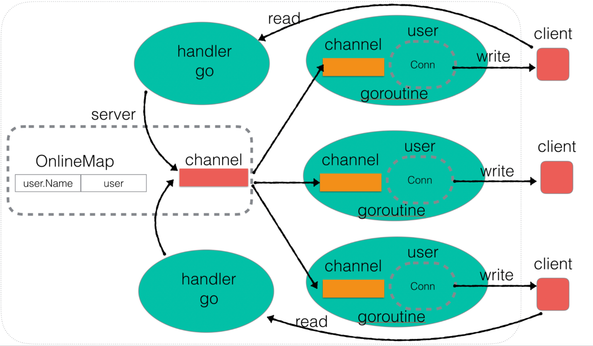

# Golang-Instant-Messaging-System

From:https://www.yuque.com/aceld/mo95lb/ks1lr9

以刘丹冰老师的项目为基础开发的改进版的基于GO语言的即时通信系统，主要是复现项目对go语言的服务器编程进行学习，并改进了一些实现细节。

## Overall aichitecture

## To run

- Build server:

  `go build -o server server.go main.go user.go`

- Build client:

  `go build -o client client.go`

- Run server:

  `./server`

- Run client:

  1.  `./client`

  2.  `nc 127.0.0.1 9999` //仅能测试服务器功能

     

## 